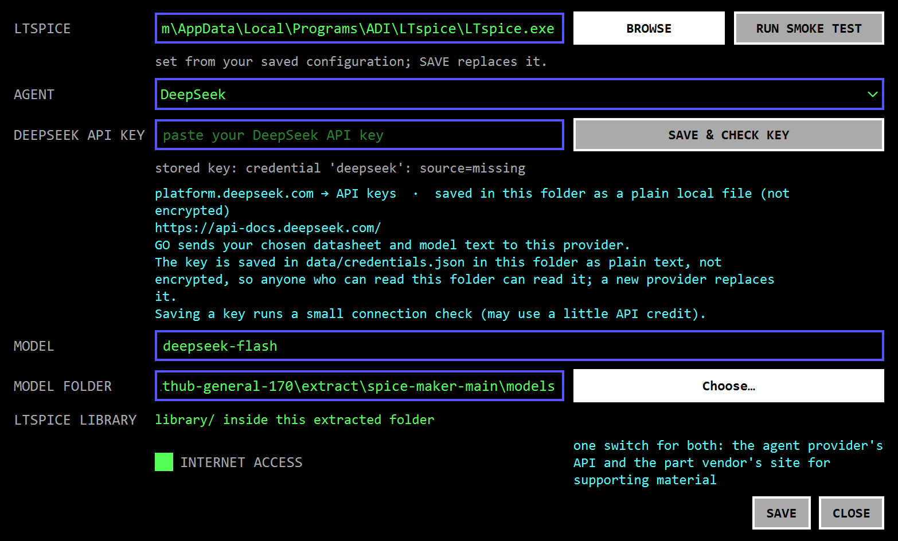

# Spice Maker 1.7.0: GitHub download-to-model check

On 2026-09-25, the published `main` commit
`fbcae51039e6c9ca3146ae49b9455a4bf92d9ca7` was downloaded from GitHub's
Code → Download ZIP endpoint and tested in a fresh extracted folder. The ZIP
was 92,143,947 bytes (SHA-256
`219e2177883aa389ad89ca30e12aa0b4821fc5e47d49bd625756548dd76963cf`).
Its 1.7.0 `Install.exe` matched `SHA256SUMS.txt` (SHA-256
`dd6784e3d642c3e4746887f213b9269295ea2365242f1a26a1c2f5a1100d47e0`).

| Stage | Result | Time |
|---|---|---:|
| Download and check ZIP | PASS | 7.2 s |
| Extract | PASS | 2.6 s |
| Run `Install.exe --silent --no-launch` | PASS | 23.5 s |
| Check Python 3.14.2, package 1.7.0 and in-folder `.venv` | PASS | 2.3 s |
| Save and read back explicit LTspice path | PASS | 1.7 s |
| Build a model from the installed copy | PASS, model verdict UNKNOWN | 8.1 s |
| Rerun its saved LTspice fixtures | PASS, 8/8 measured rows | 7.2 s |
| Reopen the saved model | PASS, preserved UNKNOWN verdict | 1.0 s |
| Start the downloaded frozen GUI | PASS, responsive setup window | 2.8 s |

The installed copy's build used the committed synthetic TPS54320 fixture and a
stand-in PDF. It delivered a `.lib`, `.asy`, model card and results with 9 PASS,
0 FAIL, 21 UNKNOWN and 8 NOT_APPLICABLE requirements. The separate saved-model
retest measured 8/8 bound rows as PASS. This checks the product path through
LTspice; it does not prove TPS54320 device accuracy. The installed copy wrote
no observed new files outside its folder during the installer check. An inherited
`LTSPICE_EXE` did not silently select the simulator; the path was saved through
the copy's own settings.

The local 1.7.0 installer build also generated
`releases/SpiceMaker-1.7.0-Windows-x64.zip`. The fresh-download verifier stopped
after model reopen, so its new-ZIP rebuild and cleanup stages were not run.
An outdated verifier expectation for inherited `LTSPICE_EXE` initially failed;
the verifier now checks that this inherited variable is ignored, as the
application requires.

